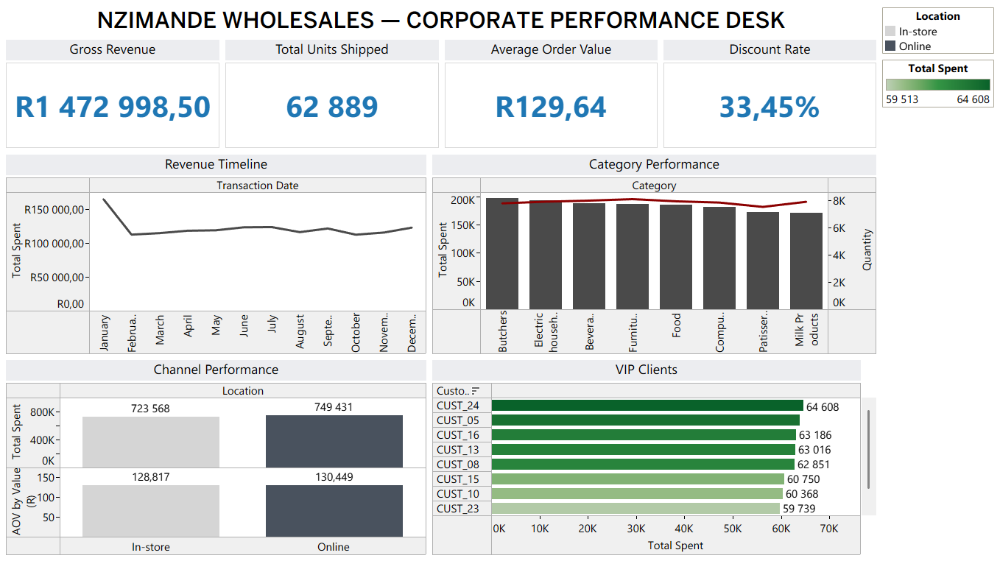

# Nzimande Wholesales — Enterprise BI & Data Architecture



> **End-to-end data analytics project:** Raw CSV → Python ETL → SQLite Database → Tableau Executive Dashboard → Strategic Business Recommendations

---

## Project Overview

Nzimande Wholesales provided a raw transactional dataset of 12,575 records with integrity violations across five columns. This project delivers a complete business intelligence pipeline — from dirty data to boardroom-ready insights — using an entirely free and open-source tool stack.

**Three strategic business questions answered:**
1. Are discounts actually driving volume, or are we giving away margin for free?
2. Which product categories are consuming warehouse space without generating proportional revenue?
3. Does online ordering outperform in-store — and where should marketing spend go?

---

## Tools Used

| Tool | Purpose |
|------|---------|
| Python 3 (Pandas, NumPy) | Data extraction, cleaning, imputation, audit trail |
| SQLite + DB Browser | Relational storage, KPI validation, strategic SQL queries |
| Tableau Public | Interactive executive dashboard |
| Jupyter Notebook (VSCode) | Pipeline development environment |

---

## Pipeline Architecture

```
[ Raw CSV: 12,575 rows ]
        │
        ▼
[ Python ETL Pipeline ]
  • Strip whitespace
  • Parse dates
  • Impute discount flags
  • Reconstruct quantities mathematically
  • Isolate unrecoverable rows to audit log
  • Formula audit: Price × Qty = Total Spent
        │
        ▼
[ SQLite Database ]
  • fact_sales_transactions (11,362 verified rows)
  • 0 formula violations
  • 5 KPIs validated via SQL before visualisation
        │
        ▼
[ Tableau Public Dashboard ]
  • 4 KPI banner cards
  • Revenue velocity timeline
  • Category performance (revenue vs volume)
  • Channel split (online vs in-store)
  • Top 10 VIP clients by lifetime value
        │
        ▼
[ Strategic Business Recommendations ]
```

---

## Verified Executive KPIs

| Metric | Value |
|--------|-------|
| Gross Revenue | R1,472,998.50 |
| Average Order Value | R129.64 |
| Total Units Shipped | 62,889 |
| Discount Rate | 33.45% |

> Every number on the Tableau dashboard is traceable to a SQL query run against a mathematically audited dataset.

---

## Key Findings

### 1. Discount Policy — Margin Leakage Confirmed
Discounted orders show **higher basket sizes and higher AOV** than full-price orders, but **lower order counts**. This proves discounts are not converting hesitant buyers — they are subsidising bulk purchasers who would have bought regardless.

**Recommendation:** Replace broad markdowns with a bulk-order threshold system (e.g. discount activates only above 50 units or R500 per order).

### 2. Inventory Inefficiency — Furniture vs Butchers
- **Butchers** = highest total revenue + high turnover = star category
- **Furniture** = highest order count but low revenue per unit = warehouse space being consumed inefficiently
- **Milk Products** = low revenue + low volume = candidate for stocking review

**Recommendation:** Introduce minimum order quantities on furniture. Evaluate cold-storage reallocation away from Milk Products toward Butchers.

### 3. Channel Profitability — Online Wins on Both Metrics
| Channel | Total Revenue | Avg Order Value |
|---------|--------------|-----------------|
| In-store | R723,568 | R128.82 |
| Online | R749,431 | R130.45 |

Online outperforms in-store on every metric with lower processing overhead.

**Recommendation:** Shift marketing budget toward digital channel acquisition. Invest in online portal UX to widen the AOV gap.

---

## Data Quality Summary

| Metric | Count |
|--------|-------|
| Raw records | 12,575 |
| Clean records (analysis-ready) | 11,362 |
| Unrecoverable rows (audit log) | 604 |
| Formula violations | 0 |
| Duplicate rows | 0 |

---

## How to Run

### 1. Clone the repository
```bash
git clone https://github.com/lk-nyoka/nzimande-wholesales-bi.git
cd nzimande-wholesales-bi
```

### 2. Install dependencies
```bash
pip install pandas numpy
```

### 3. Place raw data
Copy your `nzimande_sales.csv` file into:
```
data/raw/nzimande_sales.csv
```

### 4. Run the pipeline
Open `notebooks/nzimande_pipeline.ipynb` in VSCode and run all cells sequentially.

The notebook will:
- Clean and validate the data
- Export `data/clean/nzimande_sales_clean.csv`
- Create `database/nzimande_wholesales.db`
- Log unrecoverable rows to `data/clean/nzimande_unrecoverable_rows.csv`

### 5. Open the database (optional)
Open DB Browser for SQLite → Open `database/nzimande_wholesales.db` → run the KPI queries in `sql/kpi_queries.sql`

### 6. View the dashboard
[View Live Tableau Dashboard →](https://public.tableau.com/views/NzimandeTableau/NzimandeDashboard?:language=en-US&publish=yes&:sid=&:redirect=auth&:display_count=n&:origin=viz_share_link)

---

## Project Structure

```
Nzimande_Wholesales/
│
├── data/
│   ├── raw/                        # Original CSV (never modified)
│   └── clean/                      # Cleaned CSV + error log
│
├── notebooks/
│   └── nzimande_pipeline.ipynb     # Full ETL pipeline
│
├── database/
│   └── nzimande_wholesales.db      # SQLite analytical database
│
├── exports/
│   └── nzimande_tableau_ready.csv  # Tableau data source
│
├── sql/
│   └── kpi_queries.sql             # All strategic SQL queries
│
├── docs/
│   └── Nzimande_Business_Analysis.docx  # Full strategic report
│
└── README.md
```

---

## Certifications & Skills Demonstrated

- **Python:** Pandas, NumPy, SQLite3, data imputation, audit trail engineering
- **SQL:** Aggregations, CASE statements, window functions (RANK, OVER), NULL handling
- **Tableau:** Calculated fields, dual-axis charts, dashboard filters, KPI banners
- **Data Governance:** Mathematical formula validation, error logging, reproducible pipelines
- **Business Analysis:** Margin analysis, inventory optimisation, channel profitability

---

## Author

**Lindokuhle Nyoka**
Data Analyst | Electrical Engineering Student @ Wits University

- LinkedIn: [linkedin.com/in/lindokuhle-nyoka-a5b737413](https://linkedin.com/in/lindokuhle-nyoka-a5b737413)
- GitHub: [github.com/lk-nyoka](https://github.com/lk-nyoka)
# nzimande-wholesales-bi
